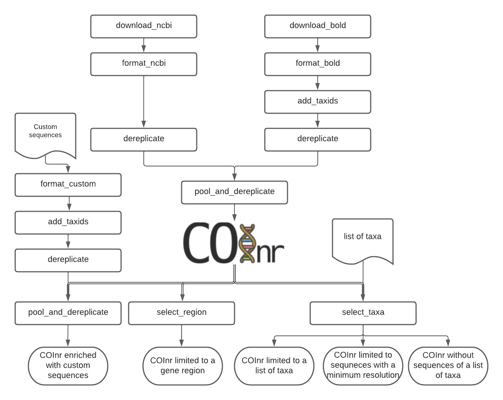

# mkCOInr

## Summary
MkCOInr is a series of Perl scripts that aims to create **COInr, a large, comprehensive, COI database form NCBI-nucleotide and BOLD**. 

COInr is freely available and can be easily downloaded at [](https://doi.org/10.5281/zenodo.6555985)


It is planned to produce a new version annually. 

Further scripts allow users to customize the database.

Major features of the creation ofCOInr:
 - Mass download of sequences and their taxonomic lineages from NCBI-nucleotide and BOLD databases
 - TaxIDs are used to avoid problems with homonyms and synonyms
 - Creation of a coherent taxID system. The hierarchical structure of the NCBI taxIDs is completed if necessary with new, negative taxIDs. 
 - When adding sequences with unknown taxIDs, taxon names are matched to already existing taxonomic lineages in the database to identify a correct existing taxID, or to assign a new one.
 - Taxonomically aware demultiplexing
 - Creation of a ready-to-use database in BLAST, RDP_classifier QIIME or a FULL tsv format

**COInr**
 - Is not specific to a particular region of the COI gene (sequences can be partial). 
 - All cellular organisms are included, even Bacteria. 
 - Sequences with incomplete lineages (e.g. assigned to a family without further precision) are present in the database
 - Taxa are taken into account only with correct latin name formats (e.g. instead of 'Proterorhinus sp. BOLD:EUFWF4948-19', the sequence is assigned to *Proterorhinus* genus without a species name)

The database can be used directly for similarity-based taxonomic assignations of metabarcoding data with any COI marker (primer pairs) of any geographical regions or target group.

Alternatively, the **database can be used as a starting point to create smaller, more specific custom databases**. Sequences can be selected for :

- A particular gene region (amplicon of a given primer pair)
- List of taxa (sequences of a taxon list can be eiter selected or eliminated)
- User-defined minimal taxonomic resolution

This can save a considerable amount of time and effort, since one of the most important challenges of creating a custom database is the mass downloading of the sequences and their pooling into a coherent taxonomic system.



**Fig.1** The full pipeline to create COInr and options to make a custom database


**Further precisions**

 - The taxonomic origin of the sequences is not checked, but taken as a face value from the source database. 
 - At the scale of the complete database I did not find a satisfactory method to blacklist sequences that are probably incorrectly assigned. However, if a small custom database is produced, the use of a phylogenetic method like SATIVA (https://github.com/amkozlov/sativa) becomes feasible and recommended to eliminate sequences of dubious origin.


## Installation

Special attention was taken to minimize dependencies. 

### Third-party programs

The following tools should be installed. (Scripts using the program are in parantheses)

 - nsdpy https://github.com/RaphaelHebert/nsdpy
   downloading sequences from NCBI
   
 - BLAST (https://blast.ncbi.nlm.nih.gov/Blast.cgi?PAGE_TYPE=BlastDocs&DOC_TYPE=Download )
   format_bold.pl (check_orientation option), format_db.pl (blast option)
   
 - vsearch (https://github.com/torognes/vsearch )
   dereplicate.pl, pool_and_dereplicate.pl, select_region.pl
   
 - cutadapt (https://cutadapt.readthedocs.io )
   select_region.pl if E-pcr is used
   

All third party programs can be easily installed to a conda environment, but it is not essential.

### mkCOInr scipts
The mkCOInr scripts are written in Perl, no installation is necessary to run them apart from the Perl interpreter already installed in all unix systems. Just download the scripts directory and you are ready.

### run mkCOInr scripts
The scripts were written and tested on Linux. MacOS users will probably be able to run them. I suggest WSL (https://docs.microsoft.com/en-us/windows/wsl/ ) for Windows users.

**To run any of the scripts, open a terminal in the 'scripts' folder and type**

~~~
cd ~/mkCOInr/scripts
perl name_of_the_script.pl -argument_name argument_value
~~~

This list of arguments and options can be obtained by typing

~~~
perl name_of_the_script.pl -help
~~~

## Tutorial

For the sake of the tutorial, I have created the following file system, and the file names in the examples will contain relative paths.
The scripts directory contains all mkCOInr scripts

~~~
mkCOInr
├── custom
│   └── COI_custom.tsv
└── scripts
    ├── add_taxids.pl
    ├── dereplicate.pl
    ├── download_bold.pl
    ├── download_taxonomy.pl
    ├── format_bold.pl
    ├── format_custom.pl
    ├── format_db.pl
    ├── format_ncbi.pl
    ├── mkdb.pm
    ├── pool_and_dereplicate.pl
    ├── select_region.pl
    └── select_taxa.pl

~~~

### Customize database 

The creation of the COInr database is explained in the [**Create COInr from BOLD and NCBI section**](### Create COInr from BOLD and NCBI). You can download this database from [](https://doi.org/10.5281/zenodo.6555985) and customize it to your needs.

Download, untar COInr and move the files to the mkCOInr/COInr directory

~~~
tar-zxvf COInr_2022_05_06.tar.gz
mkdir -p mkCOInr/COInr
mv COInr.tsv mkCOInr/COInr
mv taxonomy.tsv mkCOInr/COInr
~~~

This gives the following file structure

~~~
mkCOInr
├── COInr
│   ├── COInr.tsv
│   └── taxonomy.tsv
├── custom
│   └── COI_custom.tsv
└── scripts
    ├── add_taxids.pl
    ├── dereplicate.pl
...
~~~

The **I/O formats** section [link] gives you details about all file formats and examples are provided as well. 

#### Add custom sequences to a database

##### Format custom files

The input tsv file [link] (-custom) contains seqIDs[link], taxon name (can be at any taxonomic level) and sequences.
This script will suggest one or more lineages for each taxon name based on the existing lineages in taxonomy.tsv. It will also consider synonyms  in the NCBI taxonomy files.

~~~
perl format_custom.pl -custom ../custom/COI_custom.tsv -taxonomy ../COInr/taxonomy.tsv -outdir ../custom/format
~~~

The output lineage file (custom/format/custom_lineages.tsv) should be checked manually to see if the lineages are coherent.
If homonymy, choose the correct lineage, then delete homonymy column. This revised file will be the input to the add_taxids.pl script.


##### Add taxIDs to custom sequences

For each lineage in the input file
	- Find an existing taxID at the lowest possible taxonomic level. TaxIDs can be either from NCBI, or negative taxID already present in taxonomy.tsv
	- Add new arbitrary (negative) taxIDs to taxa, that are not yet in taxonomy file 
	- Link each new taxID to existing one as a child and include info to the updated taxonomy file
	Make a tsv file with sequences and taxIDs [link]
	Update the taxonomy.tsv file

~~~
perl add_taxids.pl -lineages ../custom/format/custom_lineages_verified.tsv -sequences ../custom/format/custom_sequences.tsv -taxonomy ../COInr/taxonomy.tsv -outdir ../custom/add_taxids 
~~~

##### Dereplicate custom sequences

Eliminate sequences that are substring of another sequence of the same taxID. Use  sequences_with_taxIDs.tsv[link] file (output of the previous script).
~~~
perl dereplicate.pl -tsv ../custom/add_taxids/sequences_with_taxIDs.tsv -outdir ../custom/dereplicate -out custom_dereplicated_sequences.tsv
~~~
The output file is in the same format as the input tsv file.


##### Pool and dereplicate datasets

Use 2 dereplicated sequence files [sequences tsv with taxIDs]

- COInr.tsv  (pool of BOLD and NCBI)
- custom_dereplicated_sequences.tsv

Pool the files and dereplicate sequences of a taxID that are present in both files

~~~
perl pool_and_dereplicate.pl -tsv1 ../COInr/COInr.tsv -tsv2 ../custom/dereplicate/custom_dereplicated_sequences.tsv -outdir ../final -out COInr_custom.tsv
~~~
The output is the same format as the input tsv file.

Your custom database is composed of two files:

- the dereplicated sequnece file (COInr_custom.tsv)
- the last version of the taxonomy file (custom/add_taxids/taxonomy_updated.tsv)

For simplicity, move the updated taxonomy file to the same folder of the sequence.

~~~
mv ../custom/add_taxids/taxonomy_updated.tsv ../final/taxonomy_updated.tsv
~~~


This database can be further customized, or you can simply format it to be ready for your taxonomic assignment program by the **format_db.pl** script.


#### Select sequences from existing database

##### Select sequences for a list of taxa with a minimum taxonomic rank

Sequences can be selected for a list of taxa and/or for a minimum taxonomic level (species/genus/family/order/class/phylum/kingdom/superkingdom/root)

The input file (-taxon_list) [link] contains a list of taxa and eventually their taxIDs.

~~~
perl select_taxa.pl -taxon_list ../final/taxon_list.txt -tsv ../final/COInr_custom.tsv -taxonomy ../final/taxonomy_updated.tsv  -min_taxlevel species  -outdir ../final/selected/ -out COInr_custom_selected.tsv
~~~
The main output is a sequence tsv file in the same format as the input.
A lineage file is also written for all taxa in the taxon_list to check if they are coherent with the target taxon names. 

See more details in the details description of the the scripts [link].

##### Excluding  sequences of a taxon list
With the same script it is also possible to eliminate sequences of taxa instead of selecting them. Set the negative_list option to 1 to do that.
~~~
perl select_taxa.pl -taxon_list ../final/taxon_list.txt -tsv ../final/COInr_custom.tsv -taxonomy ../final/taxonomy_updated.tsv  -min_taxlevel species  -outdir ../final/selected/ -out COInr_custom_reduced.tsv -negative_list 1
~~~


##### Select region

Sequences can be trimmed to a specific region of the COI gene. To define the region, you can either give a fasta file with sequences covering the region of interest, or you can detect them automatically by e-pcr, as it is in  this example.
~~~
perl select_region.pl -tsv ../final/COInr_custom.tsv -outdir ../final/amplicon/ -e_pcr 1 -fw GGNTGAACNGTNTAYCCNCC -rv TAWACTTCDGGRTGNCCRAARAAYCA -trim_error 0.3 -min_amplicon_length 280 -max_amplicon_length 345 -min_overlap 10 -tcov_hsp_perc 0.5 -perc_identity 0.7
~~~

See more details in the details description of the the scripts [link].


#### Format database 

Format the database to one of the following formats
- blast  [link]
- rdp   [link]
- qiime  [link]
- full [link]

~~~
perl format_db.pl -tsv ../final/COInr_custom.tsv -taxonomy ../final/taxonomy_updated.tsv -outfmt qiime -outdir ../final/qiime -out COInr_custom_qiime
~~~
You should use the rdp_calssifier or qiime's feature-classifier to train the database using the output files of this script if you have used the rdp or qiime options.


The full option, gives a tsv files with seqIDs, ranked lineages, taxIDs for each sequnece, and this is a very easy-to-parse, complete file.

```
perl format_db.pl -tsv ../final/COInr_custom.tsv -taxonomy ../final/taxonomy_updated.tsv -outfmt full -outdir ../final/full -out COInr_custom
```


For making a BLAST database, the taxonomy file is not necessary and the indexed files in the output folder are ready to use.
~~~
perl format_db.pl -tsv ../final/COInr_custom.tsv -outfmt blast -outdir ../final/blast -out COInr_custom
~~~


### Create COInr from BOLD and NCBI
The following steps describe how COInr database (available at [](https://doi.org/10.5281/zenodo.6555985) ) was produced. 

#### Download NCBI taxonomy

Download NCBI taxonomy dmp file and create taxonomy.tsv [link]
~~~
perl download_taxonomy.pl -outdir ../taxonomy
~~~
#### NCBI sequences

##### Download NCBI sequences

The following command will download Coding DNA Sequence (CDS) fasta files of all sequences with COI, CO1, COXI or COX1 in the title lines and complete mitochondrial genomes.
It takes several hours (days) to run this command.

~~~
nsdpy -r "COI OR COX1 OR CO1 OR COXI OR (complete[Title] AND genome[Title] AND Mitochondrion[Filter])" -T -v --cds
~~~
The results are found in the NSDPY_results/yyyy-mm-dd_hh-mm-ss folder.

sequences.fasta contains all CDS sequences. Sequences are correctly oriented but should still be filtered to keep only COI sequences.
TaxIDs.txt contains the sequenceIDs and the TaxIDs.

Move the results of nsdpy to the ../ncbi/nsdpy directory and clean up the directory.
~~~
mkdir -p ../ncbi
mv NSDPY_results/yyyy-mm-dd_hh-mm-ss ../ncbi/download
mv report.tsv ../ncbi/download
rmdir NSDPY_results
~~~

##### Format NCBI sequences

Select COI sequences and clean them. 
Eliminate identical sequences of the same taxID.
Clean tax names and taxids.
~~~
perl format_ncbi.pl -cds ../ncbi/download/sequences.fasta -taxids ../ncbi/download/TaxIDs.txt -taxonomy ../taxonomy/taxonomy.tsv -outdir ../ncbi/format
~~~
The major output is a sequence tsv file with taxIDs [link] 

##### Dereplicate NCBI sequences

Eliminate sequences that are substring of another sequence of the same taxID.
~~~
perl dereplicate.pl -tsv ../ncbi/format/ncbi_sequences.tsv -outdir ../ncbi/dereplicate -out ncbi_dereplicated_sequences.tsv
~~~
The output is the same format as the input tsv file.

#### BOLD sequences 

##### Download BOLD sequences

The following command will download all sequences and lineages for all taxa on the taxon_list from BOLD
The taxon_list file is constructed manually from taxa on https://www.boldsystems.org/index.php/TaxBrowser_Home. Each taxa on the list has less than 500M specimen records on BOLD. 
The taxon_list constructed on 2022-02-24 (bold_taxon_list_2022-02-24.txt) is available with the script (data/bold_taxon_list_2022-02-24.txt in github). This might need to be updated later.
~~~
perl download_bold.pl -taxon_list ../bold/bold_taxon_list_2022-02-24.txt -outdir ../bold/download -try_download 3
~~~
There will be a tsv file for each taxon, where the download was successful. 
The tsv file contains the taxonomic lineage, marker code, sequences and many other information.

NOTE: The download of a long list of taxa takes several days since it is not parallelized. 
You can cut up the input list and run each of them on a separate computer and move the output files to the same folder afterwards.

##### Format BOLD sequences 

Select COI sequences and clean them.
Eliminate identical sequences of the same lineage.
Clean lineages and make a list with corresponding sequenceIDs.
~~~
perl format_bold.pl -download_dir ../bold/download/files -outdir ../bold/format
~~~
The major output is the following:

- bold_sequences.tsv [sequence tsv without taxID]
- bold_lineages.tsv [lineage tsv without taxID] (all identical lineages are pooled into a same line)


##### Add taxIDs to BOLD sequences

For each lineage this script will:

- Find an existing taxID at the lowest level possible. TaxIDs can be either from NCBI, or negative taxID already present in taxonomy.tsv
- Add new arbitrary (negative) taxIDs to taxa, that are not yet in taxonomy.tsv 
- Link each new taxID to existing one as a child and include info to the updated taxonomy file
- Update input taxonomy file

~~~
perl add_taxids.pl -lineages ../bold/format/bold_lineages.tsv -sequences ../bold/format/bold_sequences.tsv -taxonomy ../taxonomy/taxonomy.tsv -outdir ../bold/add_taxids
~~~
The main output files are the following:

- sequences_with_taxIDs.tsv [sequence tsv with taxIDSs]
- taxonomy_updated.tsv [taxonomy]


##### Dereplicate BOLD sequences

Eliminate sequences that are substring of another sequence of the same taxID.
~~~
perl dereplicate.pl -tsv ../bold/add_taxids/sequences_with_taxIDs.tsv -outdir ../bold/dereplicate -out bold_dereplicated_sequences.tsv
~~~
The output is the same format as the input tsv file.


#### Pool and dereplicate datasets

Use the dereplicated sequence files from BOLD and NCBI.
Pool the files and dereplicate sequences of a taxID that are present in both files.
~~~
perl pool_and_dereplicate.pl -tsv1 ../bold/dereplicate/bold_dereplicated_sequences.tsv -tsv2 ../ncbi/dereplicate/ncbi_dereplicated_sequences.tsv -outdir ../COInr -out COInr.tsv
~~~
The output is the same format as the input tsv file.

**Move the taxonomy file to the same directory**
~~~
mv ../bold/add_taxids/taxonomy_updated.tsv ../COInr/taxonomy.tsv
~~~


## Description of the scripts


### add_taxids.pl

#### Aim

For each lineage
- Find the smallest taxon that matches an already existing taxID in taxonomy.tsv
- Assign arbitrary, negative taxIDs to taxa under this taxon

#### Input files

- lineages (lineage tsv without taxID; output of format_custom.pl or format_bold.pl) [link]
- sequences (sequence tsv without taxID)  [link]
- outdir
- taxonomy  [link]

#### Parameters/options
NONE
#### Algorithm

For each lineage finds the lowest taxon that matches an already existing taxID 
 - Finds the smallest taxon that matches an already existing taxID (taking into account all taxIDs in the input taxonomy file)
 - Accepts TaxID if at least 0.6 of the taxa in the upward input lineages matches the lineage of the taxID (for species level do not count the genus, since it matches necessarily the species name) OR Both the input taxon and taxID have a phylum rank
 - If the match between the input lineage and the taxID lineage is <= 0.25, go to the next taxlevel
 - If the match between the input lineage and the taxID lineage is between 0.25 and 0.6, print lineage to ambiguous file, and it should be checked manually

The search for an existing taxID, takes into account 
 - existing NCBI or previous arbitrary (negative) taxIDs
 - all synonym taxon names in the taxonomy file
 - If there are more than one taxIDs for the taxon name, take the one with the highest proportion of taxa matching the upwards lineage and then the one that has the same taxonomic rank

If there is no taxID for the lowest taxonomic levels in the lineage, assign arbitrary negative taxIDs to them.

New taxIDs are linked as a child to an existing taxID, and the taxonomy file is updated with them.

#### Output

- sequences_with_taxIDs.tsv (sequence tsv with taxID) [link]
- lineages_with_taxIDs.tsv (tsv file with the following columns:
  lowest_taxname	lowest_rank	lowest_TaxID	phylum	class	order	family	subfamily	genus	species	seqIDs)  [link]
 - ambiguous_lineages.tsv (tsv file with the following columns:
    match_lineage_proportion	ncbi_taxname	ncbi_taxlevel	ncbi_TaxID	phylum	class	order	family	subfamily	genus	species	ncbi_superkingdom	ncbi_kingdom	ncbi_phylum	ncbi_class	ncbi_order	ncbi_family	ncbi_genus	ncbi_species	ncbi_taxname	seqIDs) [link]
 - ambiguous_sequences.tsv (sequence file without taxID)  [link]
 - taxonomy_updated.tsv (taxonomy)  [link]


### dereplicate.pl

#### Aim
Taxonomically aware dereplication
#### Input files
 - tsv (sequence tsv with taxID)  [link]
 - outdir
 - out (name of the output dereplicated sequence tsv file)  [link]

#### Parameters/options
 - vsearch_path (path to vsearch executables if not in the PATH

#### Algorithm

Compare sequences of the same taxID. 
Delete sequences that are substring of another sequence (100% identity on the overlapping region, and one sequence covers the other completely).
If more than 10.000 sequences for the same taxID, cluster first sequences with 100% of identity using the cluster_fast algorithm of vsearch, than use the substring search for each cluster.

#### Output
- sequence tsv with taxID [link]

### download_bold.pl

#### Aim

Download BOLD data in tsv format for a list of taxa.

#### Input files
 - taxon_list (text file with one taxon per line) [link]
 - outdir

#### Parameters/options
 - try_download (integer; Try to download files *try_download* times if some of the downloaded files are incomplete; Default: 3)

#### Algorithm

Download all sequences and lineages for all taxa on the taxon_list from BOLD. The taxon_list file is constructed from taxa on https://www.boldsystems.org/index.php/TaxBrowser_Home. Each taxa on the list has less than 500M specimen records on BOLD. 

The taxon_list constructed on 2022-02-24 (data/bold_taxon_list_2022-02-24.txt) is available with on github. It contains all taxa available in BOLD. This file might need to be updated later.

Download is done using BOLD's API. First a small stat file is downloaded to access the number of records available for the taxa, then the tsv file is downloaded with sequences and metainfo.

Check if the number of downloaded records corresponds to the expected one (based on stat file).
If error, remove file and retry download try_download times

If the file exists already, skip the download. In this way, if the program stops (for example hitting wall time on a server), it can be simply restarted and the taxa with successful downloads will not be rerun.

NOTE: The download for a long list of taxa takes several days since it is not parallelized. 
You can cut up the input list and run each of them on a separate computer and move the output files to the same folder afterwards.

#### Output

- json file for each taxon with the total number of records

- tsv file for each taxon with the following columns:

  processid	sampleid	recordID	catalognum	fieldnum	institution_storing	collection_code	bin_uri	phylum_taxID	phylum_name	class_taxID	class_name	order_taxID	order_name	family_taxID	family_name	subfamily_taxID	subfamily_name	genus_taxID	genus_name	species_taxID	species_name	subspecies_taxID	subspecies_name	identification_provided_by	identification_method	identification_reference	tax_note	voucher_status	tissue_type	collection_event_id	collectors	collectiondate_start	collectiondate_end	collectiontime	collection_notesite_code	sampling_protocol	lifestage	sex	reproduction	habitat	associated_specimens	associated_taxa	extrainfo	notes	lat	lon	coord_source	coord_accuracy	elev	depth	elev_accuracy	depth_accuracy	country	province_state	region	sector	exactsite	image_ids	image_urls	media_descriptors	captions	copyright_holders	copyright_years	copyright_licenses	copyright_institutions	photographers	sequenceID	markercode	genbank_accession	nucleotides	trace_ids	trace_names	trace_links	run_dates	sequencing_centers	directions	seq_primers	marker_codes


### download_taxonomy.pl

#### Aim

Download the NCBI taxonomy dmp files (https://ftp.ncbi.nih.gov/pub/taxonomy/new_taxdump/) and prepare taxonomy.tsv file

#### Input files
 - outdir

#### Parameters/options
 - skip_download (0/1; if 1, skips download, only prepares taxonomy file; Default: 0)

#### Algorithm

Downloads ncbi taxonomy dump files from https://ftp.ncbi.nih.gov/pub/taxonomy/new_taxdump/ to the ncbi_tax subdirectory and  decompress them.
Prepares a taxonomy file [link] with all taxIDs in it.

#### Output
 - ncbi_tax subdirectory with dmp files
 - taxonomy.tsv (taxonomy)[link]

### format_bold.pl
#### Aim

Prepare a single sequence file and a lineage file from all downloaded tsv files

Clean and orient sequences

#### Input files

 - download_dir (name of the folder containing the downloaded BOLD tsv files)
 - outdir

#### Parameters/options
 - marker_list (List of markers to be selected; Default:  'COI-5P COI-3P')
 - check_name (0/1; If one keeps only taxa with valid Latin name format: Default: 1)
- max_n (positive integer; eliminates sequences with max_n or more consecutive Ns; Default:5)
- min_length (positive integer; minimum length of the cleaned sequence; Default:100)
- max_length (positive integer; maximum length of the cleaned sequence; Default:2000 )
- check_orientation (0/1; if 1, checks the orientation of the sequences; Default: 0)
- blast_path (Optional; Path to the blast executables if it is not in your PATH)

#### Algorithm

Clean downloaded files and pool information to lineage and sequence files
 - Eliminate partial lines (mostly errors in the database)
 - Select sequences for a given marker list
     - Clean sequences
     - Correct sequence IDs
     - Gaps deleted
     - Non-TCGA changed to N
     - External Ns deleted
     - Sequences with more than max_n consecutive Ns are deleted
     - Keep sequences with length in a min_length and max_length range 
 - Clean lineages
      -  If check_name, keep only names matching a correct Latin name format (only letters, spaces and -, correct capitalization)
      - Pool identical lineages into one line with the list of valid sequence IDs in the last field
      - Eliminate lines with environmental and metagenomic samples
- Orient sequence
     - Count the TAA, TAG STOP codons in each reading frame
     - Choose the orientation where there is no STOP codon
     - If STOP codon in all frames OR stand + and - among the frames without STOP codon, class it as ambiguous
     - Make a small "reference" db form randomly sampled oriented sequences
     - Blast ambiguous sequences to check orientation
     - Write sequences without hit to the bold_ambiguous_orientation.fas

#### Output

- bold_sequences.tsv (sequence file without taxIDs) [link]
- bold_lineages.tsv (lineage tsv without taxIDs) [link]
- bold_partial_lines.tsv (lines in the input tsv files that did not have sequences) [link]
- bold_ambiguous_orientation.fas (sequences that could not be oriented in check_orientation option) [link]


### format_custom.pl

#### Aim
Make a lineage file for each input taxon_name
Prepare input for add_taxid.pl

The output lineage file should be checked manually 
- To see if the suggested lineages are plausible

- Select the correct lineage if there is more than one (1 in homonymy column) for the same taxon name

Before the next step (add_taxids.pl)

- Delete the homonymy column

- Correct/delete/complete lines if lineage in not correct. Try to use taxon names compatible with NCBI taxonomy (https://www.ncbi.nlm.nih.gov/taxonomy/ )

#### Input
- custom (tsv file with the following columns: seqID	taxon_name	sequence) [link]
- taxonomy [link]
- outdir

#### Parameters/options
- max_n (positive integer; eliminate sequences with max_n or more consecutive Ns; Default: 5)
- min_length (positive integer; minimum length of the cleaned sequence; Default: 100)
- max_length (positive integer; maximum length of the cleaned sequence; Default: 2000 )
- check_seqid_format (0/1; if 1 check if seqID resemble to bold and ncbi formats, print out warnings, if yes; Default: 1)

#### Algorithm

Match names to all taxon names in taxonomy.tsv (including synonyms)
- Give a lineage to all taxon names if name matches
- If homonymy, creates a lineage for each homonym, and write 1 to the homonymy column
- If taxon name corresponds to a Latin name format (Genus species) and species name is not known, get the lineage for the genus.

If check_seqid_format
- If some of the sequence IDs are not unique, list the duplicate IDs and exit
- If sequence IDs format is similar to accessions used in BOLD and NCBI/EMBL/DDBJ, list IDs but continue
- A fairly safe format is xxx_xxx####, where x is a letter, # is a digit

clean sequences
- gaps deleted
- non-TCGA changed to N
- external Ns deleted
- sequences with more than max_n consecutive Ns are deleted


#### Output
- custom_lineages.tsv (lineage file format) [link]
- custom_sequences.tsv (sequence file format without taxID) [link]


### format_db.pl
#### Aim
Make a database in blast, rdp, qiime or full tsv format from sequence tsv and taxonomy files

#### Input files
 - tsv (sequence tsv with taxID)[link]
 - taxonomy[link]
 - outfmt (rdp/blast/qiime/full; choose the format of the database)
 - outdir
 - out (string to name the output files)

#### Parameters/options
 - blast_path (Optional; path to the blast executables if it is not in your PATH)
#### Algorithm
BLAST db

- Prepare a fasta file and the taxid (seqID, taxID) file

 - Runs the makeblastdb commande of blast to make indexed file ready to be used as a blast database

RDP, QIIME and FULL

- Prepares a ranked lineage for each taxID
- Taxon names are concatenated with taxID to avoid homonymy
- Missing taxonomic levels are completed by using the name of a higher-level taxon concatenated with the taxonomic ranks
- Prepares a trainseq fasta and a taxon file for RDP[link] and QIIME [link]
- Prepares a single tsv file for full [link]

The  trainseq fasta and the taxon files can be used by the *train* command of rdp_classifier or *feature-classifier* of QIIME to train the dataset before classification

The full tsv format is an easy to parse tsv with lineage and taxids for each sequence.


#### Output

BLAST option

- indexed files ready to be used as a BLAST database

RDP option
 - RDP trainseq fasta[link] 
 - RDP taxon file[link] 

QIIME option
 - QIIME trainseq fasta[link] 
 - QIIME taxon file[link] 

FULL option

- tsv file[link] 

### format_ncbi.pl

#### Aim

Format the CDS and taxID files to a sequence tsv file with taxIDs [link] 

Select and clean sequences

#### Input files

 - cds (CDS fasta file; output of nsdpy) 
 - taxids  (tsv file with the seqID and taxID columns; output of nsdpy) 
 - taxonomy [link] 
 - outdir

#### Parameters/options
 - check_name (0/1; If one keep only taxa with valid Latin name fomat: Default: 1)
 - max_n (positive integer; eliminate sequences with max_n or more consecutive Ns; Default: 5)
- min_length (positive integer; minimum length of the cleaned sequence; Default: 100)
- max_length (positive integer; maximum length of the cleaned sequence; Default: 2000)

#### Algorithm

- Select sequences
  - Check if gene names and protein names correspond to COI
  - Eliminate genes if they have introns
  - Can have more than one COI gene in the same mitochondrion
  - Accept only if valid taxID, replace old non-valid taxIDs by up-to-date taxIDs
  - Eliminate sequences from environmental and metagenomic samples
  - If check_name is activated, take the taxID of the smallest taxon with a valid Latin name, otherwise keep the original taxID. 
- Clean sequences
  - Upper case
  - Replace non-ATCG by N
  - Delete gaps and external Ns
  - Delete sequence if more than max_n consecutive Ns
  - Keep sequences if length is between min_length and max_length
  - Sequences are already in a correct orientation in the input file, since that are coming from CDS files

#### Output
 - ncbi_sequences.tsv (sequence tsv with taxIDs) [link] 


### pool_and_dereplicate.pl
#### Aim
Pool 2 dereplicated sequence tsv files and do a taxonomically-aware dereplication for taxIDs present in both input files

#### Input files
 - tsv1 (sequence tsv with taxID)[link] 
 - tsv2 (sequence tsv with taxID)[link] 
 - outdir
 - out (name of the output dereplicated sequence tsv file)

#### Parameters/options
- vsearch_path (path to vsearch executables if not in the PATH)

#### Algorithm
Pool sequences from two input tsv files.
The dereplication is done only for taxID shared by the two input files, since they have been dereplicated individually.
The algorithm of dereplication is identical to the one used in dereplicate.pl

#### Output
- sequence tsv with taxIDs

### select_region.pl
#### Aim

Select a target region from input sequences. 

As an input, either a primer pair should be given to identify the target region in some sequences by e-pcr, or a fasta file containing taxonomically diverse sequences limited to the target region.

The sequences are then aligned to the target sequences and trimmed according to the alignment

#### Input files

- tsv (sequence tsv with taxIDs)[link] 
- outdir
- target_region_fas (A small phylogenetically diverse fasta file with sequences already trimmed to the target region; Optional; Can be produced by e-pcr included in the script.)

#### Parameters/options

*E-pcr related parameters*

- e_pcr  (0/1; if 1, identify the target region of the sequences by e-pcr in the first step)
- fw (optional; if e_pcr is done, the sequence of the forward primer that amplifies the target region)
- rv (optional; if e_pcr is done, the sequence of the reverse primer that amplifies the target region)
- trim_error (real [0-1], the proportion of mismatches allowed between the primer and the sequence during the e_pcr; Default : 0.3)
- min_overlap (the minimum overlap between primer and the sequence during e-pcr; Defalut 10)
- min_amplicon_length (The minimum length of the amplicon after primer trimming; Default: 100)
- max_amplicon_length (The minimum length of the amplicon after primer trimming; Default: 2000)
- cutadapt_path (Optional; Path to cutadapt if it is not in your PATH)

*usearch_global related parameters*

- tcov_hsp_perc (minimum coverage of the target sequence in usearch_global hits; Default: 0.5)
- perc_identity (minimum percentage of identity between the sequence and the target in usearch_global hits; Default: 0.7)
- vsearch_path (Optional; path to the vsearch if it is not in your PATH)

#### Algorithm

A fasta file is prepared from the input tsv sequence file. 

Sequences are aligned to a small pool of target sequences already limited to the target region (target_region_fas). The alignment is done by the usearch_global command of vsearch which makes global alignments (unlike BLAST). The best hit is used for each sequence to orient and trim them to the target region. Only hits with a minimum target coverage (tcov_hsp_perc) and percentage of identity (perc_identity) are used.

The target_region_fas file can be either previously prepared by the users and given as an input, or be produced by e-pcr using the e-pcr related parameters.

To reduce runtime, sequences in the target_region_fas are clustered by -cluster_fast algorithm of vsearch and the centroids are used as a target file for the usearch_global

#### Output

- cutadapt_trimmed.fas (if e_pcr; fasta file with sequences recognized and trimmed by E-pcr; equivalent of target_region_fas )
- target_centroids.fas (fasta file of centroids of the clustering of target_region_fas or cutadapt_trimmed.fas)
- trimmed.tsv (sequence tsv files with taxIDs trimmed to the target region)[link] 
- untrimmed.tsv (sequence tsv files with taxIDs where the target region is not found)[link] 


### select_taxa.pl

#### Aim
Select or eliminate  sequences that belong to taxa on a taxon list.
Select sequences with a minimum taxonomic resolution (e.g. assigned at least to genus).

#### Input files
 - tsv (sequence tsv with taxID)[link] 
 - taxon_list  (Either a txt file with one taxon per line, OR  a tsv file with taxon name in the firs and taxid in the second column; not necessary if only the taxonomic level of the sequences should be checked by min_taxlevel)

 - taxonomy [link] 
 - outdir
 - out (name of the output dereplicated sequence tsv file)
#### Parameters/options
 - negative_list (1/0; if 1, keeps all taxa except the ones on the taxon list; Default: 0)
 - min_taxlevel (species/genus/family/order/class/phylum/kingdom/root; Default: root)

#### Algorithm

Select sequences that belong to the taxa on in a taxon list if *negative_list==0* (default). Select sequences that DO not belong to the taxa on in a taxon list, if *negative_list==1*.

Keep only sequences that are assigned to at least to *min_taxlevel* rank.
If taxIDs are not given in the taxon_list file the script uses all taxIDs that matches the taxon name.
A lineage file is written for each taxon in taxon_list and the corresponding taxIDs 
	- It should be checked manually if lineages are coherent with the target taxa
	- Homonymy column indicates if more than one taxID for a taxon
	- If there are incoherent lineages, make a new taxon_list file based on the lineage file including taxon names and taxIDs and rerun the script with the new taxon_list.

#### Output

- sequence tsv with taxIDs[link] 
- lineage file with the following columns: taxon	taxID	homonymy	number of sequences	superkingdom	kingdom	phylum	class	order	family	genus	species


## I/O formats

### ncbitax_dir
Directory containing the NCBI taxonomy dmp files (downloaded by download_taxonomy.pl)


### taxonomy
tsv file with the following columns: 
- tax_id: can be correct NCBI taxID, or arbitrary negative numbers for taxa not in NCBI
- parent_tax_id: TaxiID if the closest parent of tax_id
- rank: taxonomic rank (e.g. species, genus, subgenus, no_rank)
- name_txt: Scientifc name of the taxon
- old_tax_id: taxIDs that have been merged to the tax_id by NCBI; if more than one for a given tax_id, make one line for each old_tax_id
- taxlevel: index for major taxlevels; 8:species, 7:genus, 6:family, 5:order, 4:class, 3:phylum, 2:kingdom, 1:superkingdom; X.5 for levels between major taxonomic levels e.g. 5.5 for infra-order or superfamily
- synonyms: list of synonyms

~~~
tax_id	parent_tax_id	rank	name_txt	old_tax_id	taxlevel	synonyms
1	1	no rank	root		0	
2	131567	superkingdom	Bacteria		1	Prokaryotae;Prokaryota;Procaryotae
6	335928	genus	Azorhizobium		7	
7	6	species	Azorhizobium caulinodans	395	8	Azotirhizobium caulinodans
-34968	2778801	subfamily	Callithamnioideae		6.5	
-35035	-35034	species	Fractonotus caelatus		8	
-35036	-35030	family	Ramazzottidae		6	
~~~

### taxon_list
tsv file with a list of taxa in the first column
Optionally, taxIDs in the second column
Any other columns can follow, they will not be taken into account

~~~
taxon_name	taxID
Plecoptera	50622
Lepidoptera
Diptera
~~~


### outdir

Name of the directory to write output files

### lineage tsv without taxID
tsv file with the following columns:
- phylum
- class
- order
- family
- subfamily
- genus
- species
- seqIDs

All identical lineages are pooled into a single line, seqIDs are in the last column separated by semicolons

~~~
phylum	class	order	family	subfamily	genus	species	seqIDs
Acanthocephala							12418139
Acanthocephala	Archiacanthocephala	Gigantorhynchida	Gigantorhynchidae		Mediorhynchus		5445424;3143887
Acanthocephala	Archiacanthocephala	Gigantorhynchida	Gigantorhynchidae		Mediorhynchus	Mediorhynchus gallinarum	15188348;15188349;5445423
~~~

### sequence tsv without taxID
tsv file with the following columns:
- seqID
- sequence

~~~
seqID	sequence
12418139	AGATATTGGTATATTATATATTTTGTTTGCGTTATGAAGAGGC...
3143887	GTGATATATATAATGTCATCGGTATGAAGTGGTATTATAGGGGTGAT...
~~~

### sequence tsv with taxID
tsv file with the following columns:
- seqID
- taxID
- sequence

~~~
seqID	taxID	sequence
11611742	10236	GGGATAATATATATTTTGCTTGCATTGTGGAGGG...
10907577	-9466	TAAGATTTTGAATATTACCTCCATCAATTACATT...
GU179406_1	2921812	GGACTCCTTGGTACTTCTATAAGATTGCTTCTGT...
~~~

### BLAST database files
Binary files ready to use by BLAST. 

 - blastdn_name.nhr
 - blastdn_name.nin
 - blastdn_name.nog
 - blastdn_name.nsd
 - blastdn_name.nsi
 - blastdn_name.nsq

### full tsv
The sequence tsv ad the taxonomy files can be formatted by format_db.pl to a full tsv file containing the following columns:
 - seqID
 - taxon
 - taxID
 - taxlevel
 - superkingdom
 - superkingdom_taxID
 - kingdom
 - kingdom_taxID
 - phylum
 - phylum_taxID
 - class
 - class_taxID	order
 - order_taxID
 - family
 - family_taxID
 - genus
 - genus_taxID
 - species
 - species_taxID
 - sequence

### QIIME trainseq fasta
Fasta file with only seqIDs in the definition line
~~~
>OEB_CA11
AGTGGTCTCAGTGCTTTAATTCGCATTGAGTTAAGTCAGCCAGGTGGTTTAATGGGCAATG...
>OEB_EH10
AGTGGGTAGAGGGTTAAGAGCTTTGATCCGGGTCGAACTAAGTCAACCTGGAGGTTTACTA...

~~~
### QIIME taxon file
file with the following columns:
- seqID
- lineage

The taxonomic levels of the lineage are separated by ;
~~~
OEB_CA11	k__Metazoa_33208; p__Bryozoa_10205; c__Gymnolaemata_10206; o__Cheilostomatida_10207; f__Adeonidae_558780; g__Reptadeonella_2576536; s__Reptadeonella_violacea_-35055
OEB_EH46	k__Metazoa_33208; p__Bryozoa_10205; c__; o__; f__; g__; s__
...
~~~
Negative taxIDs are allowed.
Empty taxlevels are filled out using the name of higher-level taxa.

### RDP trainseq fasta
Fasta file with the definition as follows
~~~
>seqID cellularOrganisms;superkingdom_taxID;kingdom_taxID;phylum_taxID;class_taxID;order_taxID;family_taxID;genus_taxID;species_taxID
~~~
Negative taxIDs are allowed (e.g. Orbinia_johnsoni_-91).
Empty taxlevels are filled out using the name of higher-level taxa (e.g. Polychaeta_6341_order).

~~~
>MG655623_1 cellularOrganisms;Eukaryota_2759;Metazoa_33208;Ctenophora_10197;Nuda_1919246;Beroida_37538;Beroidae_37539;Beroe_10199;Beroe_forskalii_140453
ATTTTAGATAAATGATTAGGTTCTGTTTATCATTACAATATTGCTTCTTTATATTTTTTTTTTTCTATTTCTTTAGGGTTTTGTGCCTTTTTTTATTCTTTTATTATAAGATTGTCTTTAGTTTGGCCTTTTGCATTTCTATCTTCAGGTTCTATCTATTTGCATTACGTTACTT
>7437763 cellularOrganisms;Eukaryota_2759;Metazoa_33208;Annelida_6340;Polychaeta_6341;Polychaeta_6341_order;Orbiniidae_46603;Orbinia_195262;Orbinia_johnsoni_-91
CGAACAGAACTAGGCCAACCCGGCTCTCTTCTTGGAAGAGACCAACTATACAATACAATTGTTACCGCTCACGCAGTATTAATAATTTTCTTTCTTGTAATGCCCGTCCTAATTGGAGGATTTGGCAACTGACTTGTCCCTTTAAT
~~~

### RDP taxon file
file with the following columns separated by stars:
- taxID
- taxon_name_taxID
- parent taxID
- taxonomic rank index ('root',1, 'superkingdom',2, 'kingdom',3, 'phylum',4, 'class',5, 'order',6, 'family',7, 'genus',8, 'species')
- taxonomic rank 
~~~
-1*Acanthogyrus_cheni_-1*2493664*8*species
-10*Amynthas_sexpectatus_-10*195544*8*species
-100*Meiodrilus_adhaerens_-100*2723626*8*species
-1000*Runcinia_erythrina_-1000*486328*8*species
-10000*Psaltoda_claripennis_-10000*1225615*8*species
-10001*Psaltoda_flavescens_-10001*1225615*8*species
...
-35075*Polychaeta_6341_order*6341*5*order
~~~
Negative taxIDs are allowed.
Empty taxlevels are filled out using the name of higher-level taxa.

